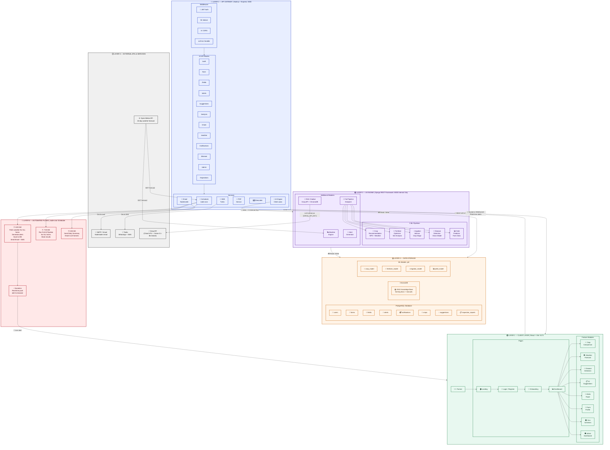
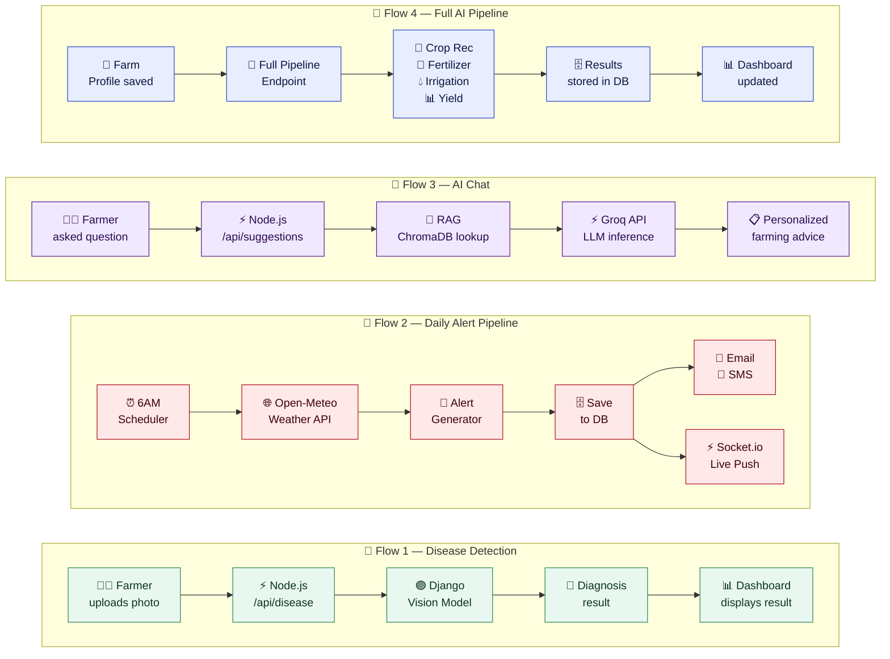

# 🌿 FarmSense AI — System Architecture
### *AI-Powered Smart Farming for India 🇮🇳*

> **LLM Provider:** ~~Ollama (local)~~ → **Groq API** (`llama-3.1-8b-instant` for chat, `qwen/qwen3.6-27b` for vision)

---

---

## 🔑 Key Data Flow Paths

---

## 📦 Tech Stack Summary

| Layer | Color | Technology | Notes |
|-------|-------|-----------|-------|
| 🟢 Frontend | Green | React + Vite `:5173` | i18n Hindi/English, Socket.io client |
| 🔵 Backend | Blue | Node.js + Express `:5000` | JWT Auth, Helmet, CORS, node-cron |
| 🟣 AI Engine | Purple | Django REST Framework `:8000` | Python, scikit-learn, Pillow vision |
| 🟡 Database | Amber | PostgreSQL | Full relational schema, 9+ tables |
| 🟡 Vector Store | Amber | ChromaDB | RAG knowledge base for AI chat |
| 🟡 ML Models | Amber | .pkl files | crop, fertilizer, irrigation, yield |
| ⚡ LLM | Gray | **Groq API** (Cloud) | `llama-3.1-8b-instant` (chat), `qwen/qwen3.6-27b` (vision) |
| 📱 SMS | Gray | Twilio | WhatsApp + SMS notifications |
| 📧 Email | Gray | Nodemailer | Gmail SMTP with HTML templates |
| 🌐 Weather | Gray | Open-Meteo API | Free, 16-day forecast, no key needed |

---

## 🕐 Automated Schedule

| Time | Job | What Happens |
|------|-----|-------------|
| ⏰ 6:00 AM | Weather + Alerts | Fetch Open-Meteo → generate alerts → save DB → Email + SMS |
| ⏰ 7:00 AM | Full AI Pipeline | Run all 5 ML modules for every farm → store results |
| ⏰ 8:00 AM | Daily Summary | Send HTML summary email to all registered farmers |
| ⚡ Real-time | Socket.io | Instantly push alerts to farmer's open browser tab |

---

---

## ⚡ LLM Provider Note

> **Why is there a file called `ollama_service.py`?**
> The file was originally built for Ollama (local LLM). When Ollama stopped working, it was swapped to **Groq API** internally — but the filename was kept as-is to avoid breaking imports.

| File | Old (broken) | Current (active) |
|------|-------------|------------------|
| `ai/decision_engine/ollama_service.py` | Ollama local | **Groq** `llama-3.1-8b-instant` |
| `ai/decision_engine/vision_service.py` | — | **Groq** `qwen/qwen3.6-27b` (vision) |
| `suggestions/services/suggestion_service.py` | — | **Groq** (LLM enrichment) |

**Groq** is NOT the same as Grok (xAI). Groq is a hardware+API company that runs open-source models (Llama, Qwen, etc.) on their own ultra-fast **LPU chips** in the cloud.

---

*FarmSense AI v2.0 — Built for Indian Farmers 🇮🇳*
